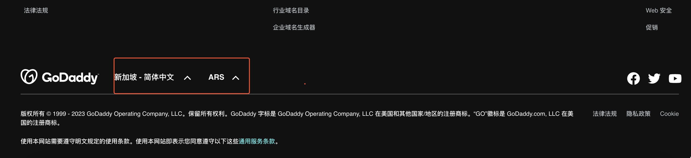
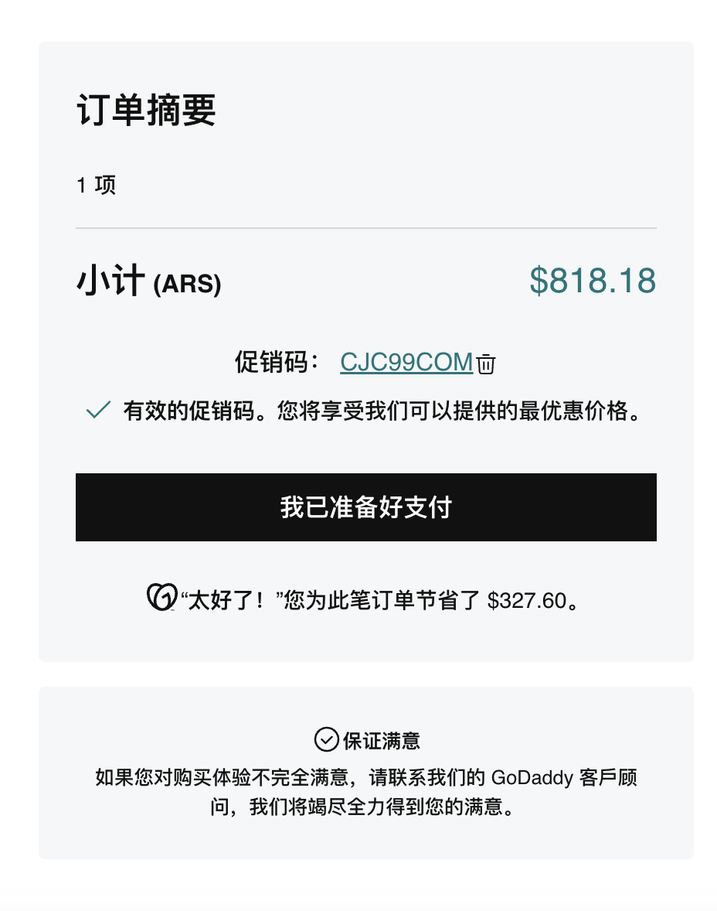
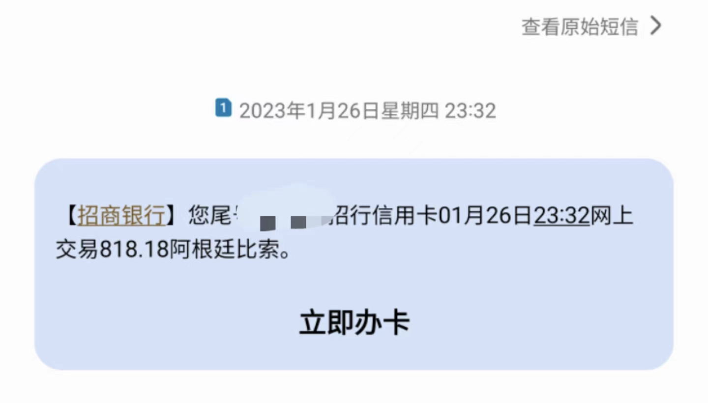
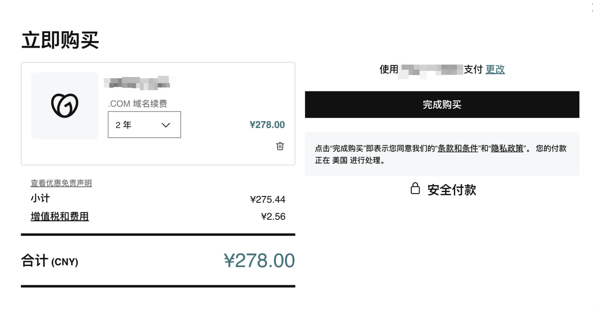
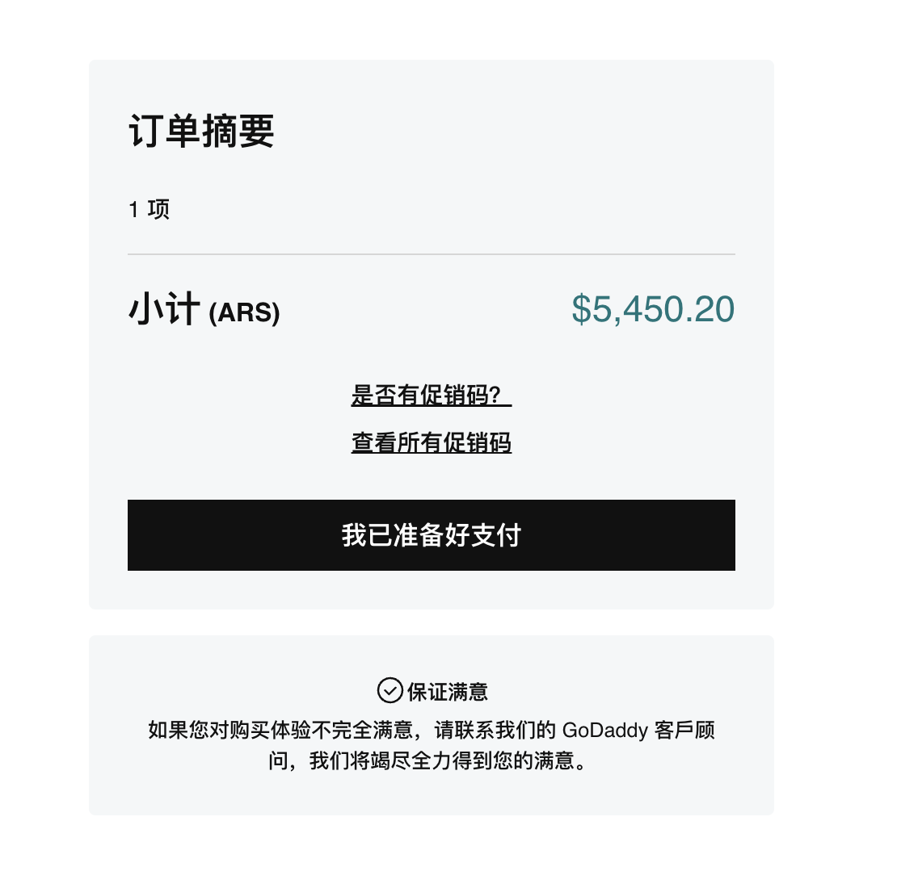

过年好，标题是我开玩笑的，阿根廷央行的一个新政策，本意是用黑市汇率促进大家去阿根廷旅游消费，结果搞出来了bug，变成了只要能找到地方允许用阿根廷货币支付，一切消费大概 30% - 40% OFF 左右，本质原因还是阿根廷的： **“双轨制汇率”** 

{{< bookmark image="https://www.uscreditcardguide.com/wp-content/uploads/IMG_5830-rotated-e1674777583529.jpg" icon="https://www.uscreditcardguide.com/favicon.ico" url="https://www.uscreditcardguide.com/fengkuangdeagentingyangxingbaiyibutie-liyong-visa-mastercard-agentinghuishuailoudong-shixianba/#12_informal_rate"  des="【2023.1.28 更新】 大概率已死，不要撸了！系统时间 2023.1.28，Visa 正式调整汇率，USD-ARS 返回 official rate （约 1 usd = 189.0 ars），ARS-USD 基本维持 informal rate（约 326.7 ars = 1 usd），也就是说再以ars消费，会支付基本相同金额的 usd，但一旦发生退货，只能获得原始支出的 58% ！ 【...Read more"  title="疯狂的“阿根廷央行百亿补贴” — 利用 Visa/Mastercard 阿根廷汇率漏洞 实现六折消费！【奇技淫巧】【更新：已过期】"  >}}

<!--more-->操作前提是有 VISA 全币种卡，以 godaddy 为例，教程：

### Godaddy 主站切换地区币种

进入狗爹主站下拉到最下面，建议为新加坡区，支付方式为 ARS（阿根廷比索）

### 结算
选需要续费的域名，进入购物车结算即可，具体金额以信用卡 POST 金额为准。

以目前汇率，818 比索不到30块人民币的样子，实际操作下来大概 7 折左右，这两天很多人撸了酒店已经住进去了，还有定机票、报旅行团的，甚至有交学费的，有一些最终没有 POST，有一些已经成功。

### 其他续费 case

200/278 , 大概 7 折 左右。

### 还能买什么？


直接看坛里大佬们的操作好了👆🏻

